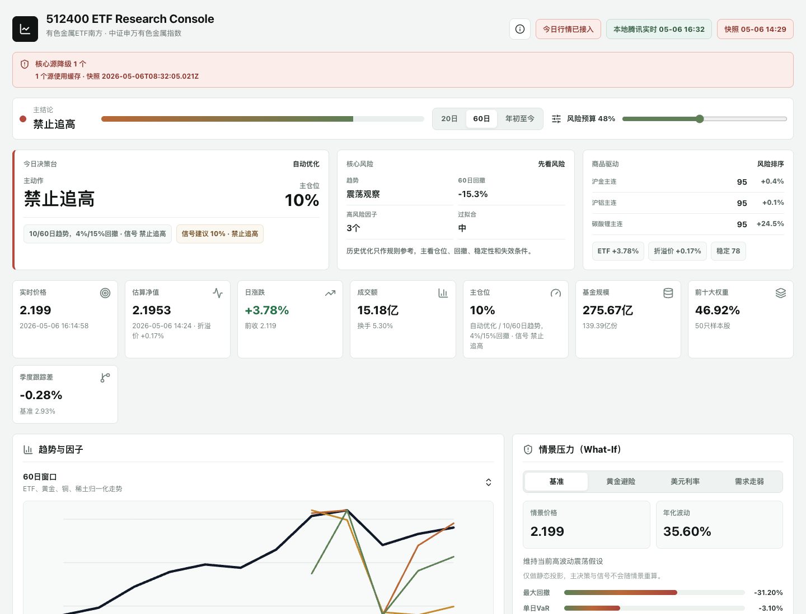

# 512400 ETF Research Console

[](https://github.com/Leonard-Don/etf-512400/actions/workflows/ci.yml)


有色金属 ETF 南方（512400）的本地实时行情与研究决策台。它把盘中行情、估算净值、折溢价、流动性、商品驱动、跟踪质量和历史策略验证放到一个单页控制台里，用于自用研究、复盘和交易前检查。



## 快速上手

```bash
npm install
npm run refresh:data   # 拉取研究快照，写入本地 JSON
npm run dev            # 启动 Vite 开发服务器（含实时行情代理）
```

开发服务器启动后打开其地址即可看到控制台。完整命令见下方「命令」。

## 它解决什么

交易前想搞清楚的几个问题：

- 今天是追高、观望，还是只等回撤低吸？
- 当前 512400 的实时价格、涨跌幅、成交额、换手和折溢价是否正常？
- 黄金、铜、铝、锂、稀土这些商品驱动里，哪些在贡献趋势，哪些在放大风险？
- 512400 相对 000819 基准的跟踪质量、流动性和净值偏离是否需要额外检查？
- 历史样本里，趋势跟随、回撤低吸、因子共振和自动优化规则的收益与回撤表现如何？

控制台为此提供的能力：

- **实时行情层**：运行时请求 512400 最新报价，东方财富 quote/kline 不可用时用腾讯行情兜底。
- **今日决策台**：聚合主动作、主仓位、核心风险、商品风险排序和当前数据新鲜度。
- **信号实验室**：用趋势、因子、折溢价、流动性和风险预算合成当前动作与建议仓位。
- **自动策略优化**：搜索趋势窗口、回撤档位和风控阈值，并做样本外验证评分。
- **跟踪与交易质量**：对比 000819 基准，监控跟踪差、折溢价温度和成交额分位。
- **动态策略回测**：展示买入持有、趋势跟随、回撤低吸、因子共振等历史参考结果。
- **降级可见**：任一数据源失败或回退时，页面明确标出来源和新鲜度，不伪装成实时。
- **本地优先**：不提供交易入口；刷新、历史缓存（`src/data/history/512400-snapshots.json`）和复盘都在本地完成。

## 数据口径

这个项目有两层数据，不会把所有数据都伪装成实时：

| 层级 | 刷新方式 | 用途 | 主要入口 |
| --- | --- | --- | --- |
| 运行时实时行情 | 页面启动后请求，本地开发环境约 30 秒刷新 | 价格、涨跌幅、成交额、换手、交易时间 | `src/analysis/realtimeQuote.js`、`/api/realtime/*` |
| 研究快照 | 手动运行 `npm run refresh:data` 写入本地 JSON | K 线、基准、净值趋势、商品驱动、持仓、历史缓存 | `scripts/refreshData.mjs`、`src/data/liveSnapshot.json` |

当前接入的数据源包括：

- 东方财富行情接口：512400 quote、512400 日 K、000819 基准日 K、期货/指数行情与 K 线
- 腾讯行情接口：512400 实时报价兜底
- 天天基金脚本：单位净值、累计净值、阶段收益、净值序列
- 天天基金估算净值：盘中估值与估算涨跌幅
- 上交所、中证指数和基金公告：持仓、指数编制和基础资料

## 命令

| 命令 | 作用 |
| --- | --- |
| `npm run dev` | 启动 Vite 开发服务器与实时行情代理 |
| `npm run refresh:data` | 拉取研究快照写入本地 JSON，并追加历史缓存 |
| `npm run memo:export -- --format=text` | 基于本地快照导出研究备忘 memo（`--format` 支持 `markdown` / `json` / `text`） |
| `npm run health` | 终端数据源健康诊断（见下） |

实时行情代理只在本地开发服务器中启用，用于规避浏览器跨域限制。

### `npm run health`

把 `src/analysis/snapshotHealth.js` 暴露的新鲜度契约包装成终端诊断 CLI，方便研究脚本、CI 或定时任务在没有浏览器时轮询数据源健康。

```bash
npm run health                           # 默认彩色表格
npm run health -- --format=json          # 机器可读 JSON（无 ANSI 颜色）
npm run health -- --format=markdown      # 可粘贴进 commit/issue 的 markdown 表
npm run health -- --snapshot=/tmp/x.json # 指定其它快照路径
npm run health -- --quiet                # 仅在 stale/missing 时输出，便于 cron grep
```

退出码：`0` 全部数据源 fresh（或 recent 缓存兜底）；`1` 至少一个源 stale，先 `npm run refresh:data` 再决策；`2` 至少一个核心源 missing 且无缓存兜底，或快照文件不存在 / 不是合法 JSON。

## 验证

```bash
npm run lint
npm run test
npm run build
```

CI 在 `main` 推送与 pull request 上执行 lint、单元测试、Vitest 组件测试、smoke test 与构建。

## 项目结构

```text
src/
  analysis/                  信号、趋势、实时行情解析、自动优化、动态回测、新鲜度与格式化函数
  components/                页面展示组件
  hooks/useRealtimeQuote.js  实时行情轮询 hook
  config/thresholds.js       信号引擎可调阈值
  data/etf512400.js          ETF、持仓、因子、风险、事件样例数据
  data/liveSnapshot.json     刷新脚本生成的当前研究快照
  data/history/              本地刷新历史缓存
  App.jsx / App.css          研究工作台界面与样式
scripts/
  refreshData.mjs            拉取并写入研究快照
  exportMemo.mjs             基于快照导出研究备忘 memo
  health.mjs                 快照新鲜度终端诊断（npm run health）
  smokeTest.mjs              核心分析链路冒烟验证
tests/
  *.test.mjs                 Node 单元测试
  *.test.jsx                 Vitest 组件测试
```

## 项目状态

**v1.0 self-use stable** (2026-05-16) — feature development frozen.

这是个人对 512400 ETF 的研究控制台，定位是单一研究工具，不追求泛化到其他 ETF。当前版本是有意收口的稳定状态：

- 数据 fallback 契约（运行时实时 + 手动快照双层）已稳定
- 策略 / 因子 / 优化器 / 回测 / 健康度评分均有单元与组件测试覆盖
- zero / falsy / non-finite / NaN sanitization 大扫除已收尾
- `npm run health` CLI 让快照新鲜度契约可被 cron / CI 直接消费

后续维护策略：

- 不规划新功能开发
- 仅接受 blocking bug、数据源结构变化（东方财富/腾讯/天天基金接口失效）、安全问题修复
- 保留向 fresh worktree 进行实验的能力，但 primary checkout 视为稳定基线
- 受保护的 dirty cache 文件 (`src/data/history/512400-snapshots.json` + `liveSnapshot.json`) 是预期 dirty，禁止 `git reset` / 强拉覆盖
- 测试与构建回归是收口验证基线

## 使用边界

这是个人研究工具，不是交易系统，也不构成投资建议。所有实时行情和研究快照都依赖公开网页接口、本地代理和本地缓存；遇到接口限流、节假日、盘后或源站结构变化时，页面会显示降级状态，研究结论需要人工复核。

## 📬 合作与交流 · Collaboration & Contact

如果你也在做单标的研究台、ETF 本地工具、多源数据 fallback 架构，或者你是有色金属产业链相关从业者想看价格信号研究方法，欢迎通过 [Issues](https://github.com/Leonard-Don/etf-512400/issues) 交流。⭐ 觉得对你的工具栈有帮助也欢迎 star。

If you're building single-ticker research consoles, ETF local-first tools, quant data fallback architectures, or you're working in the nonferrous metals industry and want to discuss price signal methodology, feel free to open an [Issue](https://github.com/Leonard-Don/etf-512400/issues). ⭐ Stars are welcome if this gave you ideas for your own stack.
